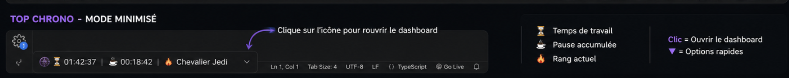
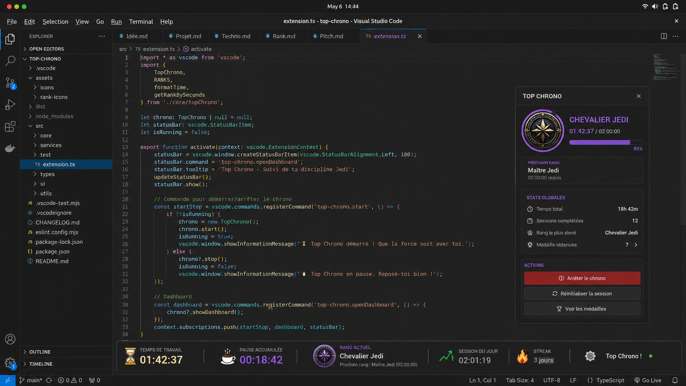
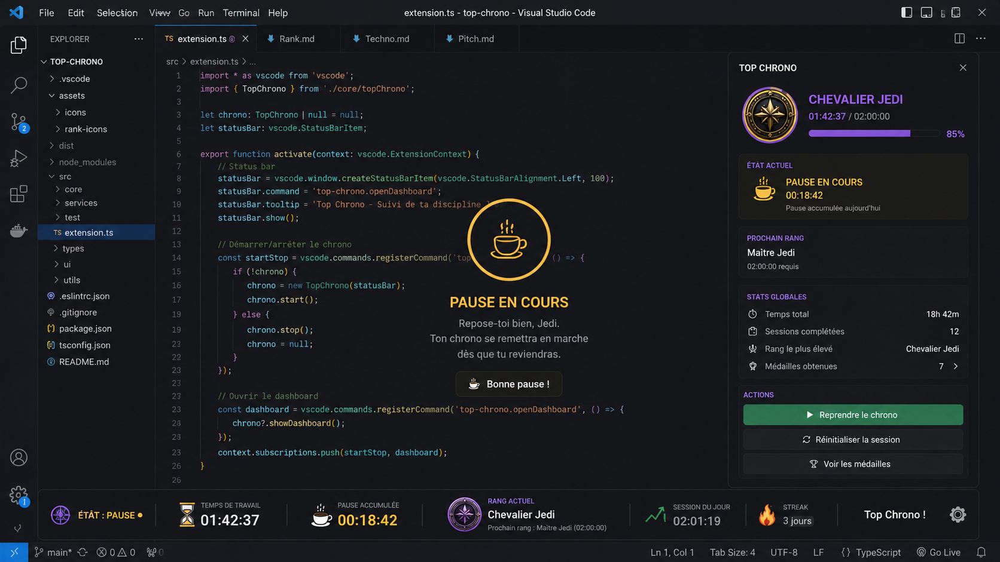
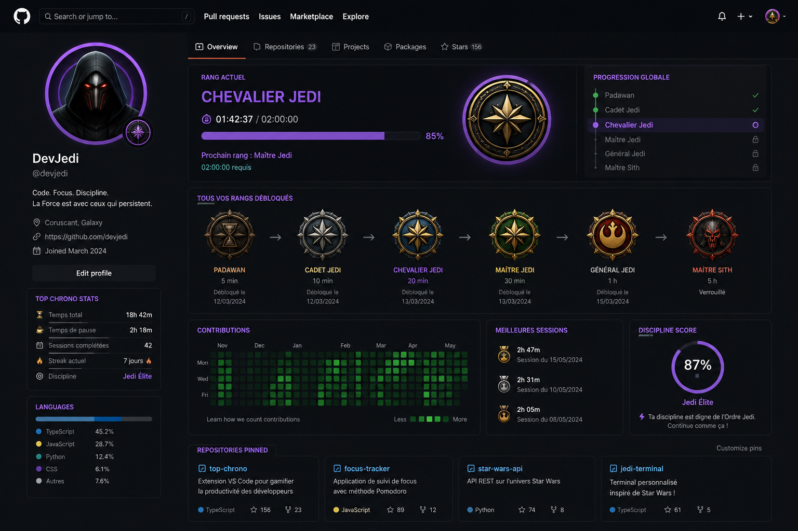
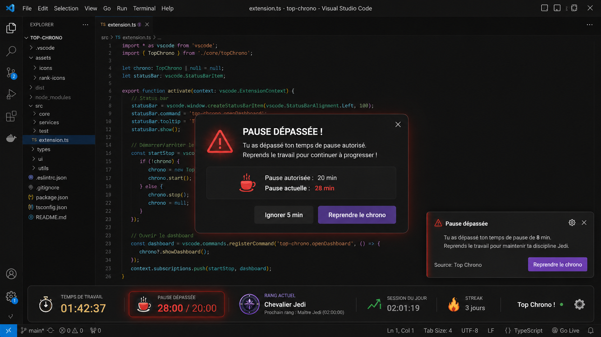
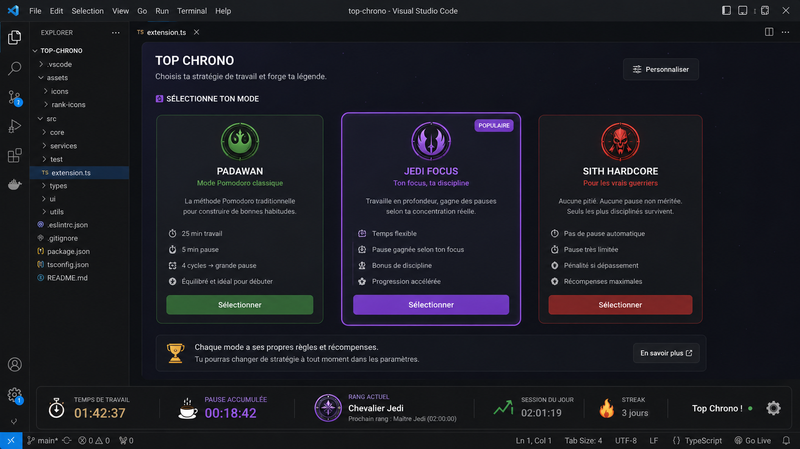
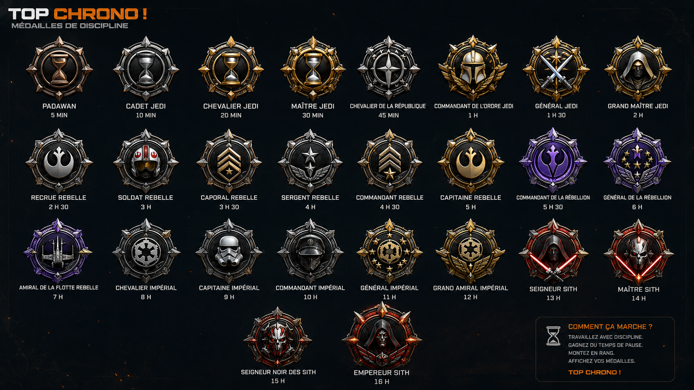

# Top Krono — extension VS Code

**Top Krono** gamifie le focus directement dans l’éditeur : chrono de travail, rangs, pauses méritées, dashboard type HUD et export pour GitHub. Pensée pour un **hackathon** : simple à démo, sans backend.

---

## Sommaire

- [Prérequis](#prérequis)
- [Installation et lancement en développement](#installation-et-lancement-en-développement)
- [Commandes disponibles](#commandes-disponibles)
- [Comment ça marche](#comment-ça-marche)
- [Captures et maquettes (dossier Doc)](#captures-et-maquettes-dossier-doc)
- [Structure du code](#structure-du-code)
- [Tests](#tests)
- [Empaqueter l’extension (optionnel)](#empaqueter-lextension-optionnel)

---

## Prérequis

- [Node.js](https://nodejs.org/) (LTS recommandé)
- [Visual Studio Code](https://code.visualstudio.com/) **≥ 1.118** (voir `engines.vscode` dans `package.json`)
- Aucune dépendance runtime : tout est local, API VS Code uniquement

---

## Installation et lancement en développement

### 1. Cloner et entrer dans le dossier de l’extension

Le code de l’extension vit dans le dossier **`top-krono-`** à la racine du dépôt hackathon.

```bash
git clone <url-du-repo>
cd Hackathon_POC_AntiProcrastination/top-krono-
```

### 2. Installer les dépendances et compiler

```bash
npm install
npm run compile
```

Cela génère notamment `dist/extension.js`, point d’entrée défini dans `package.json` (`"main": "./dist/extension.js"`).

### 3. Ouvrir le projet dans VS Code

Ouvre le dossier **`top-krono-`** (pas seulement le parent), pour que `${workspaceFolder}` et le debug pointent au bon endroit.

```bash
code .
```

### 4. Lancer l’extension (Extension Development Host)

1. Onglet **Run and Debug** (Ctrl+Shift+D).
2. Choisir la configuration **Run Extension** (fichier `.vscode/launch.json`).
3. **F5** (ou bouton vert *Start Debugging*).

Une **deuxième fenêtre** VS Code s’ouvre : c’est l’**Extension Development Host**. C’est **dans cette fenêtre** que tu testes Top Krono.

### 5. Si F5 ne fait rien

- Vérifie que `launch.json` utilise bien `--extensionDevelopmentPath=${workspaceFolder}` (ou le chemin absolu vers `top-krono-`).
- Évite un `preLaunchTask` cassé : tu peux compiler à la main avec `npm run compile` avant F5.
- Ouvre bien le workspace **`top-krono-`**, pas uniquement le repo parent.

---

## Commandes disponibles

Dans l’**Extension Development Host**, ouvre la palette (**Ctrl+Shift+P** sur Linux/Windows, **Cmd+Shift+P** sur macOS) :

| Commande dans la palette | ID technique | Rôle |
|---------------------------|--------------|------|
| **Start Top Chrono** | `top-krono.start` | Démarre une session (chrono travail + gains de pause). |
| **Top Chrono: Start Break** | `top-krono.startBreak` | Entre en mode pause (consomme le crédit pause). |
| **Top Chrono: Resume Work** | `top-krono.endBreak` | Quitte la pause et repasse en travail. |
| **Open Top Chrono Dashboard** | `top-krono.openDashboard` | Ouvre le panneau webview (HUD). |
| **Top Chrono: Export GitHub Summary** | `top-krono.exportGithubBadge` | Copie un résumé Markdown dans le presse-papiers (README, profil, etc.). |

Un clic sur l’entrée **Top Chrono** dans la **barre de statut** ouvre aussi le dashboard (si configuré ainsi dans le code).

---

## Comment ça marche

### Session et chrono

- Après **Start Top Chrono**, le temps de **travail** augmente chaque seconde.
- La **barre de statut** affiche en continu le travail, la pause disponible et le **rang** actuel (format compact type `mm:ss`).

### Rangs

Les seuils sont définis dans `src/topChrono/ranks.ts` (ex. Padawan, Cadet Jedi, …). Le rang monte automatiquement quand le temps de session atteint chaque palier.

> Pour une **démo rapide**, le projet peut utiliser des seuils très courts (quelques dizaines de secondes) : regarde les valeurs `minSeconds` dans `ranks.ts`.

### Pause « méritée »

- Tu **gagnes** du temps de pause via l’**activité** (frappe dans l’éditeur, changement de fichier actif, sauvegarde) et via des **bonus automatiques** périodiques (voir constantes dans `src/topChrono/session.ts`).
- **Start Break** : tu passes en pause ; le crédit diminue. Si tu dépasses le crédit, un **dépassement** est compté et des alertes peuvent s’afficher (toasts / modales selon l’implémentation actuelle).

### Dashboard (HUD)

- Panneau dédié avec stats, progression vers le prochain rang, état pause, boutons d’action.
- Référence visuelle du projet : maquettes dans le dossier **`Doc/`** du repo (voir section suivante).

### Export GitHub

La commande d’export génère un bloc **Markdown** (rang, temps de session, pause, totaux, médailles) et le **copie dans le presse-papiers**. Colle-le dans un `README.md` ou une issue pour partager ta progression.

### Icône Padawan

L’image `assets/icons/image.png` est utilisée dans le **dashboard** au rang Padawan. Dans la **barre de statut**, VS Code n’affiche pas de PNG directement dans le texte : l’**infobulle** peut montrer l’image au survol (comportement selon version / thème).

---

## Captures et maquettes (dossier Doc)

Les PNG vivent dans **`Doc/`** à la racine du dépôt. Dans les fichiers Markdown **à l’intérieur de `Doc/`** (comme `Projet.md`), tu peux référencer ainsi :

```markdown

```

Ici, le README est dans **`top-krono-/`**, donc le chemin vers les mêmes fichiers est **`../Doc/...`** (sinon l’aperçu et GitHub ne résolvent pas l’image).

**Visuel principal (HUD / inspiration UI)**


**Autres visuels**













> Si une image ne s’affiche pas sur GitHub : vérifie que les fichiers `Doc/*.png` sont bien versionnés (non ignorés par `.gitignore`).

---

## Structure du code

```
top-krono-/
├── src/
│   ├── extension.ts          # Activation, commandes, webview dashboard
│   └── topChrono/
│       ├── session.ts        # État session, timer, pause, persistance
│       ├── ranks.ts          # Paliers de rangs
│       ├── format.ts         # Affichage des durées
│       ├── statusBar.ts      # Rendu barre de statut
│       └── github.ts         # Markdown export GitHub
├── assets/icons/             # Icônes (ex. Padawan)
├── dist/                     # Sortie build (extension.js)
├── package.json
└── tsconfig.json
```

---

## Tests

```bash
npm run compile-tests
npm test
```

`npm test` lance VS Code en mode test et peut nécessiter un accès réseau pour télécharger le binaire de test selon ton environnement.

Contrôles rapides sans lancer l’UI :

```bash
npm run check-types
npm run lint
```

---

## Empaqueter l’extension (optionnel)

Avec [vsce](https://github.com/microsoft/vscode-vsce) :

```bash
npx @vscode/vsce package
```

Cela produit un fichier `.vsix` installable via **Extensions → … → Install from VSIX…**.

---

## Liens utiles

- [Extension API](https://code.visualstudio.com/api)
- [Publishing extensions](https://code.visualstudio.com/api/working-with-extensions/publishing-extension)

---

*Projet hackathon — Top Chrono : code, gagne ta pause, monte en grade.*
